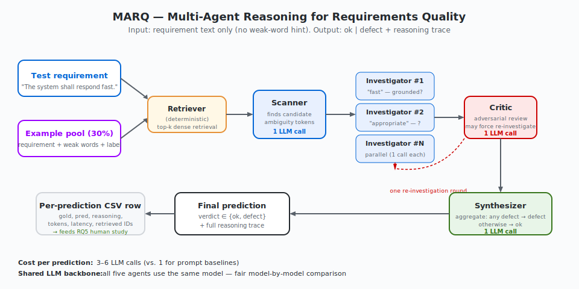
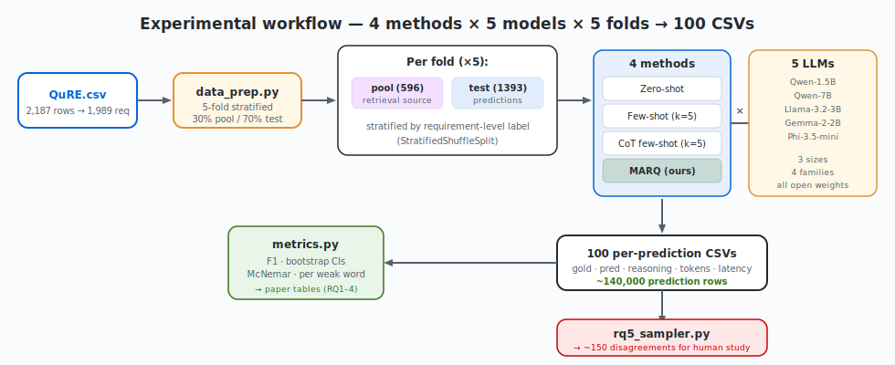

# MARQ — Multi-Agent Reasoning for Requirements Quality

> Detect ambiguity defects in industrial software requirements **from the requirement text alone** (no weak-word hint at test time), using a multi-agent system over five small open language models — and use the resulting reasoning traces to **audit the QuRE benchmark itself**.

**Plan:** a first short study, followed by a longer full study.

Companion to two prior artifacts:
- *Automatic Prompt Engineering for Requirements Classification* (REFSQ 2025) — studied prompting.
- *QuRE LoRA Lab* — studied weight-level adaptation.

This repo asks the next, harder question: **can an agentic reasoning system match prompt-based baselines on requirement-level defect detection without fine-tuning — and can its reasoning trace tell us when the gold labels themselves are wrong?**

### Publication strategy — a short study, then a longer one

The work is split into two papers, and the research questions are scoped accordingly.

**First, a short study.** Presents the MARQ architecture and its motivation (why the problem calls for a *structured, multi-agent* solution rather than better prompting — see [`MOTIVATION.md`](MOTIVATION.md)), then reports **RQ1 only**. RQ1 is sufficient for a short study: it empirically demonstrates the underlying hypothesis — that an agentic system is needed for this problem and that simpler prompting baselines are not enough — which justifies introducing the approach. It deliberately stops there, leaving industrial applicability and practical implications for the full study.

**Then, a longer full study.** Extends the story with **RQ2–RQ6**: ruling out the strongest cheap monolithic alternatives (RQ2), scaling across models and families (RQ3), agent ablations (RQ4), the cost-quality frontier (RQ5), and the QuRE benchmark audit (RQ6). These assess when and how the approach is worth its overhead in practice, and turn the reasoning traces into a benchmark-audit contribution.



---

## The harder task

QuRE (Femmer et al., REW 2025) provides labeled `(requirement, weak_word) → ok/defect` pairs. The model is *told* which weak word to evaluate. Real reviewers aren't.

We reformulate to the requirement level:

> A requirement is `defect` if *any* of its annotated weak-word instances is `defect`. It is `ok` only if *all* are `ok`.

At test time, methods receive **only the requirement text**. The weak-word annotation is hidden — accessible only inside the example pool used for in-context learning.

---

## Research questions

The central hypothesis is **not** that "more reasoning" helps, but that
*structured, decorrelated* reasoning is better matched to requirement-level
defect detection than monolithic reasoning inside a single prompt. When the
weak-word hint is hidden, the task splits into a recall-oriented *locating*
subtask and a precision-oriented *judging* subtask, and intermediate verdicts
need verification whose errors are decorrelated from the generator's — none of
which a single reasoning trajectory (including CoT or self-consistency) can
provide. See [`MOTIVATION.md`](MOTIVATION.md) for the full argument, the running
example, and the per-agent rationale.

| RQ | Study | Question |
|---|---|---|
| **RQ1** | **Short** | Does structured multi-agent reasoning (MARQ) — separating recall-oriented location from precision-oriented judgment and adding decorrelated verification — outperform monolithic single-trajectory prompting on requirement-level defect detection, **when the weak word is not supplied**? |
| **RQ2** | Full | Do the strongest *cheap* monolithic alternatives close the gap? That is, does adding reasoning depth (CoT) or trajectory voting (CoT + self-consistency) to a single agent recover MARQ's quality, or is the multi-agent structure doing something they cannot? |
| **RQ3** | Full | How do the effects in RQ1–RQ2 hold across model scale (1.5B → 7B) and four open model families? |
| **RQ4** | Full | What is the contribution of each agent in MARQ? *(Ablations: drop Critic, drop Scanner, single-agent fallback, no retrieval.)* |
| **RQ5** | Full | What is the cost-quality trade-off across the configuration grid? *(Tokens, latency, CO₂ per prediction; Pareto frontier.)* |
| **RQ6** | Full | **When the LLM's verdict disagrees with the QuRE gold label, who is right?** Human study over a stratified sample of disagreements. |

**RQ1 is the whole of the short study's empirical content.** It tests the core
hypothesis: that structure — not more reasoning — is what this task needs, so a
multi-agent system beats monolithic prompting (including CoT). Demonstrating this
justifies introducing MARQ.

**RQ2–RQ6 are the full-study continuation.** RQ2 hardens RQ1 against the
strongest cheap alternative (CoT + self-consistency) so "MARQ wins" cannot be
dismissed as "you never tried the obvious thing"; RQ3–RQ5 establish generality
and the cost-quality trade-off needed to argue industrial applicability; and RQ6
is the headline contribution of the full study — auditing QuRE through the
reasoning traces. Industrial requirements datasets carry well-known label noise from reviewer subjectivity. We use the LLMs' **reasoning traces** — captured for every prediction by every method — to surface cases where the published gold label is plausibly wrong, then ask human raters to adjudicate blind. This reframes the LLM from "tool that gets ~80% right" to "tool that can audit a published benchmark."

---

## Data design — 30 / 70 with 5-fold CV

No validation split, no separate OOD split. Just:

| Split | Fraction | Purpose |
|---|---|---|
| **Pool** | 30% | Labeled examples available to all methods (in-context retrieval source). Carries `(requirement, [weak_words], [per-word labels], requirement-level label)`. |
| **Test** | 70% | Held-out evaluation. Methods see only requirement text. |

**Cross-validation.** `StratifiedShuffleSplit` with `n_splits=5` and `train_size=0.30`, stratified on the requirement-level label. Five independent 30/70 splits; results are mean ± std across folds. This is closer to what the requirements-engineering community refers to as "k repeats of stratified holdout" than to classical k-fold, but it correctly reflects what we want — variance over the 30/70 sampling, not variance over the test partition.

Hyperparameters (k=5 for retrieval, prompt wording, agent loop counts) are **fixed across folds**, set once before any experiments, and documented in the paper. We don't tune on fold splits.

---

## Methods compared (4 methods × 5 models × 5 folds = 100 runs)

All four methods produce a reasoning string for every prediction. The reasoning is logged in the per-prediction CSV — both for the cost analysis and, crucially, for RQ6.

> **Every prompt used by every method and agent is reproduced verbatim in [`PROMPTS.md`](PROMPTS.md)**, together with the fixed decoding settings and per-call token budgets. Prompts are set once, before any runs, and held constant across folds and models.

### 1. Zero-shot
Single LLM call. Prompt asks for a brief one-sentence reasoning before the verdict.

### 2. Few-shot (k=5)
Five examples retrieved from the pool by dense similarity (`sentence-transformers/all-MiniLM-L6-v2`). Each demo contributes: `(requirement → label)`. The demos' annotated weak words and per-word labels are shown so the model can see which words were judged problematic. Single LLM call.

### 3. CoT few-shot (k=5)
Same five retrieved demos, but each carries a one-sentence reasoning chain synthesized once (cached) from `(requirement, weak_word, label)` by a teacher model. The test example is solved with an explicit "think step by step" instruction. Single LLM call.

### 4. MARQ (proposed)
Multi-agent system. See architecture below. Multiple LLM calls per prediction.

---

## The MARQ system



| Agent | Role | LLM call? |
|---|---|---|
| **Retriever** | Dense top-k retrieval over the example pool. Output: 5 labeled examples + metadata. | No (deterministic). |
| **Scanner** | Reads the requirement + retrieved examples. Identifies candidate ambiguity concerns (spans + reasons). The scanner *learns* what looks weak from the examples, not from a fixed lexicon. | 1 call. |
| **Investigator** (one per concern, parallel) | For each scanner concern, judges grounded vs. vague. Returns `{verdict, confidence, rationale}`. | N calls (typically 1–3). |
| **Critic** | Adversarial review. Challenges low-confidence verdicts and verdicts that contradict retrieved demos. May trigger one re-investigation round. | 1 call. |
| **Synthesizer** | Aggregates surviving verdicts → final label + natural-language rationale. Logic: any defect → defect; all ok → ok. | 1 call. |

Total cost per prediction: typically 3–6 LLM calls. This is the agentic overhead being measured in RQ5.

---

## Output format — every prediction is a CSV row

This is the central artifact. Every method × model × fold writes to `results/{method}__{model}__fold{k}.csv` with columns:

```
fold, model, method, requirement_id, requirement_text,
weak_words_annotated, per_word_labels_annotated, gold_label,
pred_label, reasoning, n_llm_calls, input_tokens, output_tokens,
latency_ms, retrieved_pool_ids
```

`reasoning` is the verbatim model output for prompt baselines, or the full multi-agent trace (joined with delimiters) for MARQ. This is the column humans read in RQ6.

---

## RQ6 protocol — auditing QuRE through LLM reasoning

QuRE was annotated through real industrial review, but published labels are not infallible — annotators can disagree, miss things, or apply criteria inconsistently across years.

**Step 1.** Pool all (model, method, fold) predictions. For each test requirement, count how many of the 20 (4 methods × 5 models) configurations disagreed with the gold label. *Highly contested requirements* are those where ≥10/20 configurations disagree.

**Step 2.** Sample ~150 disagreement cases stratified by:
- Direction (LLM says ok / gold says defect; LLM says defect / gold says ok).
- Method (proportional across four methods).
- Model family (proportional across five models).

**Step 3.** Three human raters (one author, two RE-researcher volunteers) independently judge each case using a unified instrument:
- They see the requirement and the LLM's reasoning trace.
- They are **blind** to which label is gold and which is LLM.
- They produce their own ok/defect verdict and a confidence (1–5).

**Step 4.** Compute:
- Inter-rater agreement (Krippendorff's α).
- For each disagreement: who do humans side with — LLM or gold?
- Net label-error estimate for QuRE on the sampled subset.
- Per-method "LLM wins / gold wins / humans split" breakdown.

**Step 5.** Report implications for benchmark design and a candidate cleaned subset of QuRE.

This RQ is the move that makes the paper interesting beyond the algorithmic contribution.

---

## Repo layout

```
.
├── README.md
├── MOTIVATION.md         # hypothesis + running example + per-agent rationale
├── PROMPTS.md            # verbatim prompts for every method and agent
├── requirements.txt
├── data_prep.py          # QuRE → requirement-level, 5-fold 30/70 CV
├── retrieval.py          # dense retriever over the pool
├── baselines.py          # zero-shot, few-shot, CoT (with reasoning capture)
├── agents.py             # Scanner / Investigator / Critic / Synthesizer
├── orchestrator.py       # MARQ pipeline with reasoning trace
├── run_evaluation.py     # main entry: 4 methods × 5 models × 5 folds → CSVs
├── metrics.py            # F1, bootstrap CIs, McNemar, per-weak-word
├── rq5_sampler.py        # build the human-study sample from disagreements
├── assets/               # architecture & workflow SVGs
└── scripts/
    ├── prepare.sh
    ├── run_all.sh
    └── make_paper_tables.sh
```

---

## The five models

| Model | Params | Family | Why included |
|---|---|---|---|
| `Qwen/Qwen2.5-1.5B-Instruct` | 1.5B | Qwen | Small end of useful range |
| `Qwen/Qwen2.5-7B-Instruct` | 7B | Qwen | Same family at 4× size — clean scaling comparison |
| `meta-llama/Llama-3.2-3B-Instruct` | 3B | Llama | Different pretraining mix, common industry choice |
| `google/gemma-2-2b-it` | 2B | Gemma | Distilled from a frontier model |
| `microsoft/Phi-3.5-mini-instruct` | 3.8B | Phi | Reasoning-optimized SLM |

Three sizes (1.5B / 2–4B / 7B), four families, all open weights, all runnable on a single consumer GPU.

---

## Quickstart

```bash
pip install -r requirements.txt

# 1) Build 5 folds of 30/70 pool/test splits
python data_prep.py --csv QuRE.csv --out splits/ --n_folds 5

# 2) Synthesize CoT reasoning chains for pool (one-time)
python baselines.py prepare-cot --pool splits/ --teacher Qwen/Qwen2.5-7B-Instruct

# 3) Run full evaluation grid (writes per-(method,model,fold) CSVs)
python run_evaluation.py --splits splits/ --out results/ \
    --methods zero_shot few_shot cot marq \
    --models qwen-1.5b qwen-7b llama-3b gemma-2b phi-3.5

# 4) Compile paper tables + Pareto plot
python metrics.py compile --in results/ --out paper/tables/

# 5) Build the human-study sample for RQ6
python rq5_sampler.py --in results/ --out paper/human_study/sample.csv --n 150
```

---

## Expected contributions

*Short study:*

1. **Task reformulation** to requirement-level defect detection without weak-word hints — a more realistic setting than published QuRE.
2. **MARQ**, a multi-agent system whose reasoning trace is a first-class artifact, not an afterthought, motivated by the structural properties of the task (see [`MOTIVATION.md`](MOTIVATION.md)).
3. **Evidence for the core hypothesis (RQ1):** structured multi-agent reasoning beats monolithic prompting (zero-shot, few-shot, CoT) across five small open LMs × 5 folds, with bootstrap CIs and significance tests.

*Full study (follow-up):*

4. **Robustness and generality (RQ2–RQ3):** ruling out CoT + self-consistency as a cheap substitute, and scaling across model sizes and families.
5. **Cost-quality Pareto frontier (RQ4–RQ5)** over the configuration grid — actionable for practitioners.
6. **Benchmark audit (RQ6)** — using LLM reasoning to identify probable mislabels in QuRE and quantifying label noise on a sampled subset.

---

## License & citation

Code under MIT. QuRE under CC-BY-4.0 (cite Femmer et al., REW 2025).

```bibtex
@misc{zadenoori2026marq,
  title  = {{MARQ}: Multi-Agent Reasoning for Industrial Requirements Quality},
  author = {Zadenoori, Mohammad Amin and others},
  year   = {2026},
  note   = {Under review, ICSE 2027}
}
```
